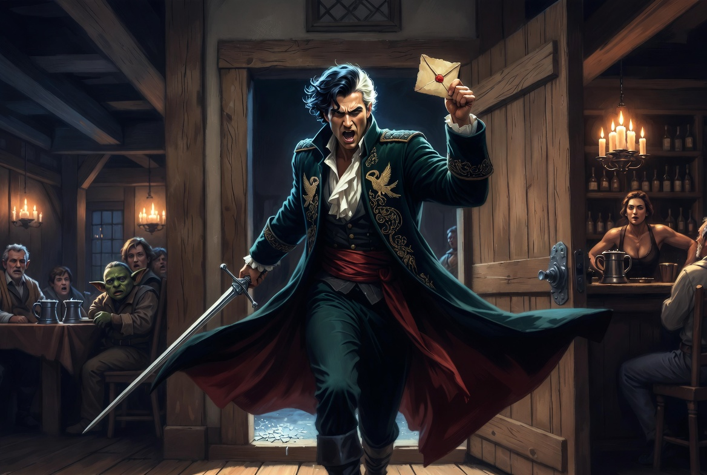
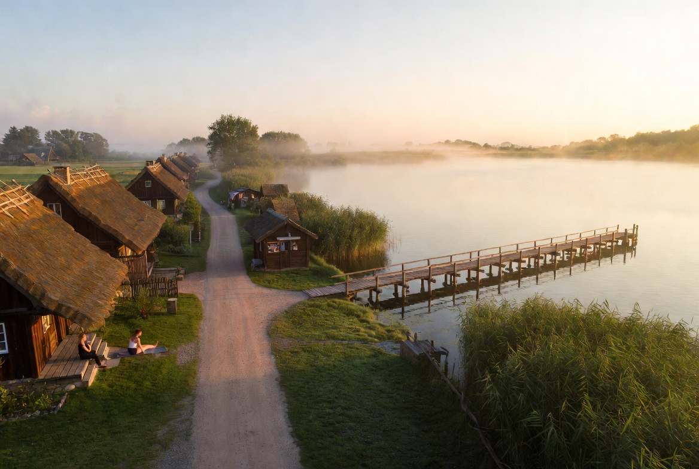
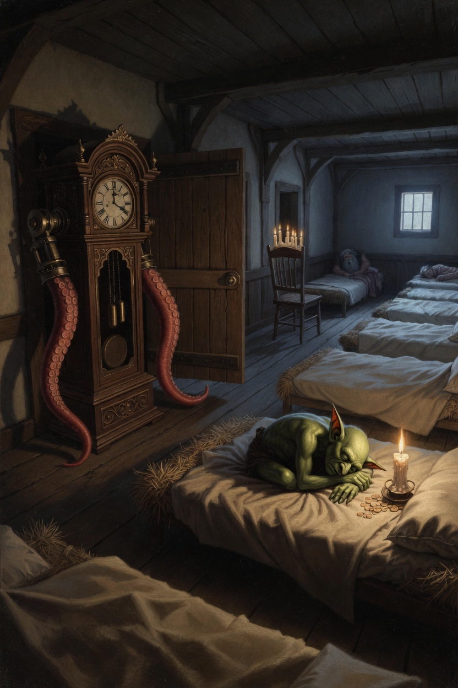
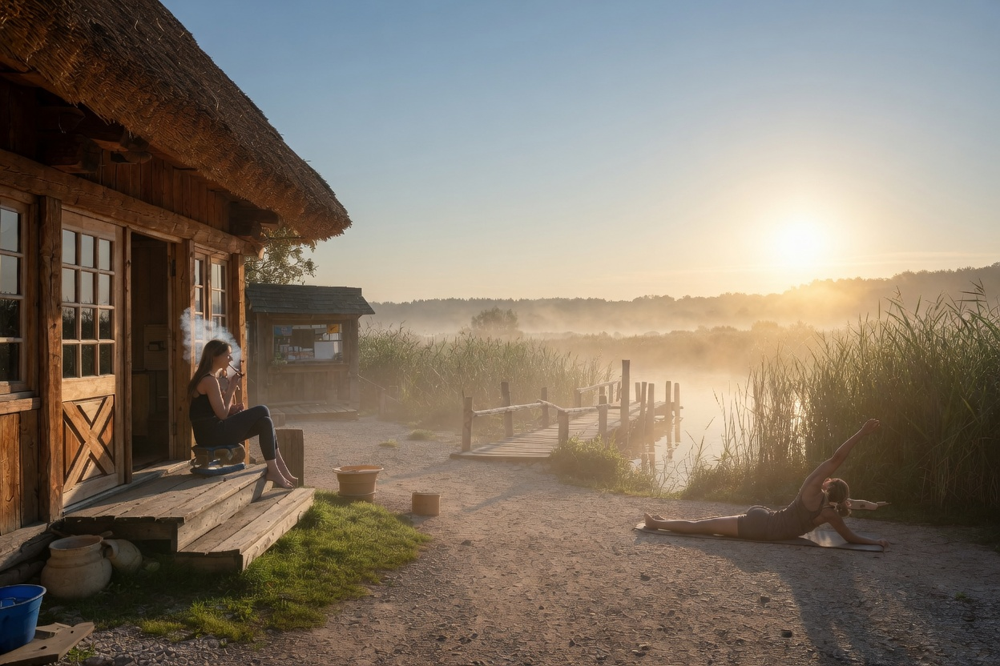
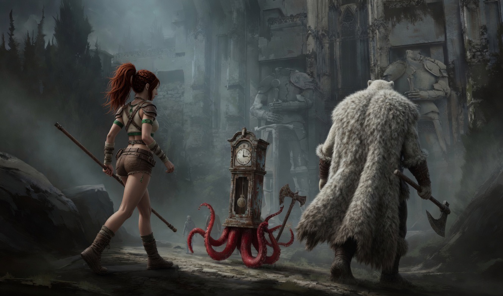
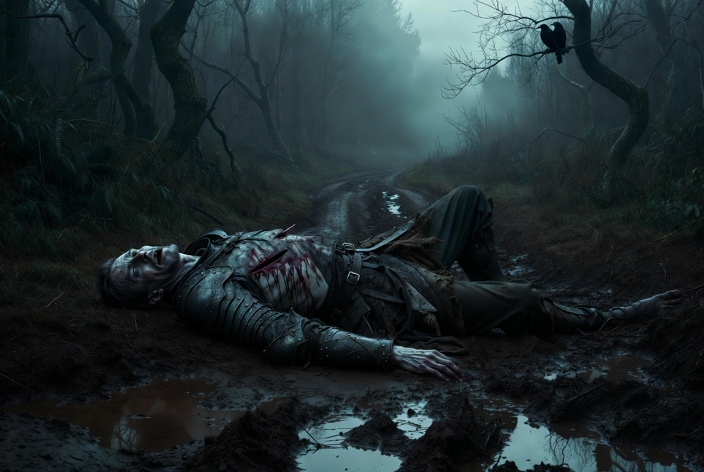
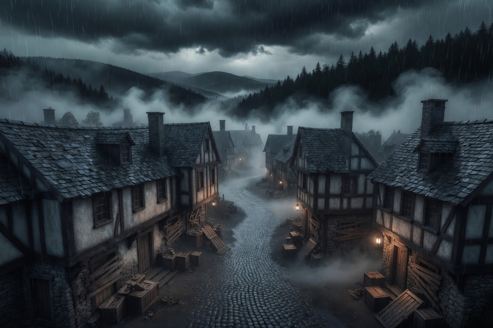
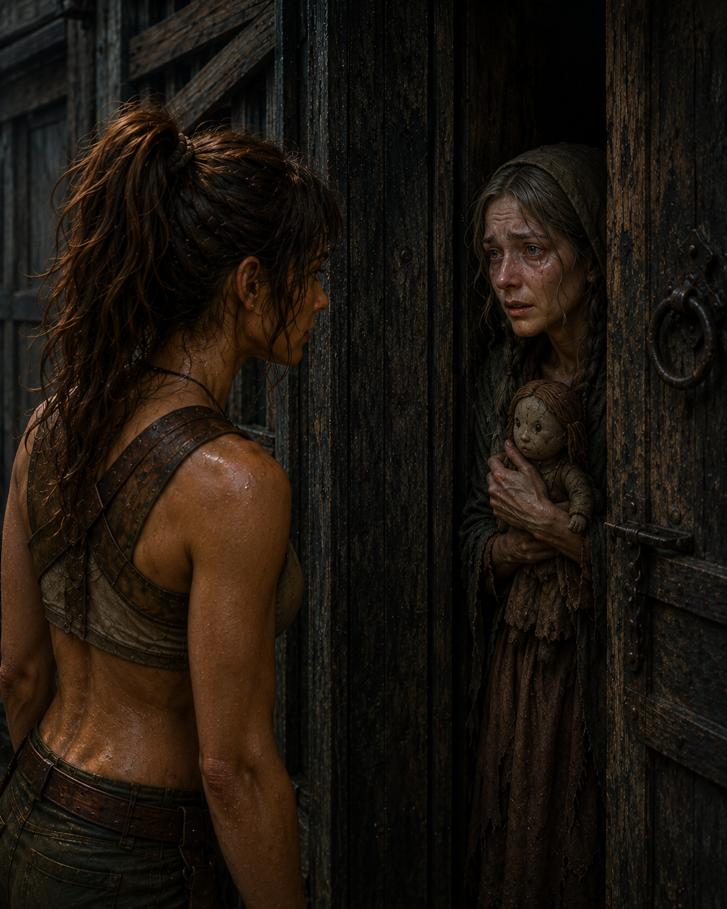
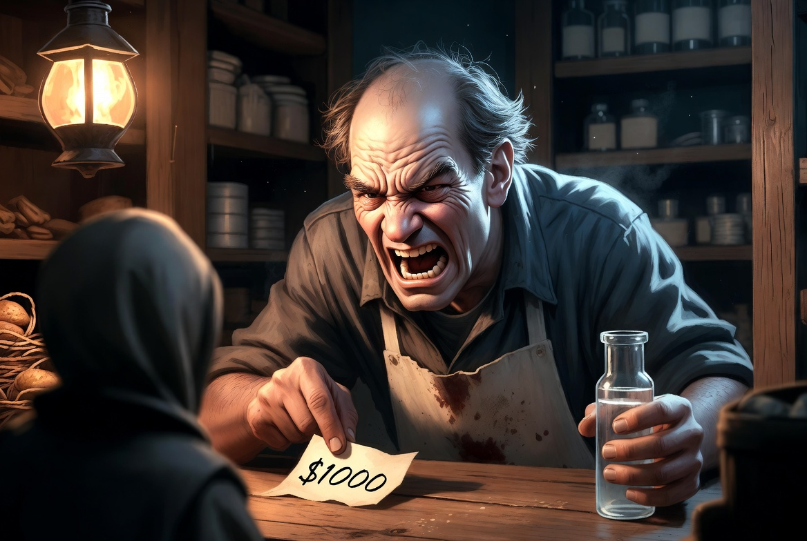
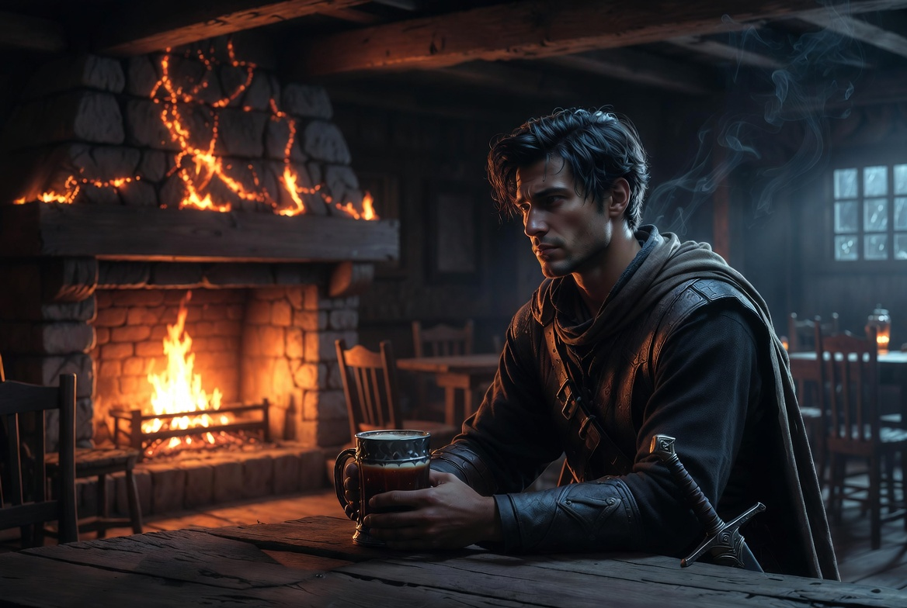

# Session 001 – Zwischen Schilfheim und Barovia
**Datum:** 2026-05-13
**DM:** Jana
**Ort in der Spielwelt:** Schilfheim → Swalitsch Wald → Dorf Barovia

---

## Zusammenfassung
Die Party nimmt in Schilfheim einen Hilferuf des Bürgermeisters von Barovia an und reist durch den unheimlichen Swalitsch Wald — Wölfe, Nebel und ein toter Bote inklusive. Im verrottenden Dorf Barovia warten zwei Handlungsstränge: eine weinende Mutter, deren Tochter der Teufel entführt hat, und im Wirtshaus der Sohn des Bürgermeisters mit der beunruhigenden Enthüllung, dass der Brief, der sie hierher lockte, nicht von seinem Vater stammt.

---

## Die Party
| Spieler | Charakter | Rasse | Klasse | Level |
|---------|-----------|-------|--------|-------|
| Raffi | [Nia Sommerfeld](../../../charaktere/nia-sommerfeld/charakterbogen.md) | Mensch | Bard (College of Dance) | 3 |
| Felix | [Florpthyz Dread](../../../charaktere/florpthyz-dread/charakterbogen.md) | Gnom/Standuhr | Fighter (Eldritch Knight) | 3 |
| Andi | [Alberich von Steinkreis](../../../charaktere/alberich/charakterbogen.md) | Zwerg | Cleric (Domain of Light) | 3 |
| Tom | [Thorin](../../../charaktere/thorin/charakterbogen.md) | Mensch | Barbarian | 3 |
| Svenja | [Moxie](../../../charaktere/moxi/charakterbogen.md) | Goblin | Ranger (Monster Slayer) | 3 |
| Anna | [Mara Winterried](../../../charaktere/mara/charakterbogen.md) | Mensch | Bard | 3 |

---

## Was passiert ist

### Abend in Schilfheim — Die Kneipe "Zum Schilf"
> Arigal von und zu Nachtigall stürmt in die Kneipe und übergibt Brief + 100 Gold im Auftrag des Bürgermeisters von Barovia — die Adoptivtochter siecht dahin, die Party soll helfen.

*[alle]*

Die Party erholt sich nach ihrem letzten Abenteuer in Schilfheim, einem kleinen Dorf am See im goldenen Sonnenuntergang. Schilf, Steg, hübsch. Die Kneipe "Zum Schilf" ist gut gefüllt; Bardame **Selia** hinter der Theke besticht durch auffällige Muskulatur, die sie gern zur Schau stellt.

Draußen zieht Nebel auf. Die Tür wird aufgestoßen: **[Arigal von und zu Nachtigall](../npcs/arigal-nachtigall.md)**, ein Mann in bunten, edlen Kleidern, stürmt herein, sucht sofort die Party und legt Brief und Geldbeutel (100 Goldkronen) auf den Tisch. Der Brief kommt von **[Koljan Indirovic](../npcs/koljan-indirovic.md)**, dem Bürgermeister des Dorfes Barovia — und enthält die Namen aller Partymitglieder. Wie der Bürgermeister von ihnen weiß, erklärt Arigal nicht.

Inhalt des Briefes: Seine Adoptivtochter **[Irena Koljana](../npcs/irena-koljana.md)** siecht an einer Wunde dahin, befallen von "tödlichem Bösem". Arigal empfiehlt, den Swalitsch Wald nicht bei Nacht zu betreten. Westlich, die Alte Swalitsch-Straße entlang, liege Barovia — circa fünf Stunden Fußmarsch. Dann schwingt er sich aufs Pferd und galoppiert davon.

Das Gold wandert in den Sack. Damit gilt der Auftrag als angenommen.

### Nacht und Morgen — Fund in den Ritzen
> Flori bewacht die Tür des Massenlagers mit Alarm-Zauber und eigenem Körper; Mara findet zwischen den Matratzen einen Metallknopf mit fremdem Wappen und einen Rubin.

*[Mara]*

Die Party hat das **Massenlager** der Kneipe für sich allein — ein langer Raum mit einer Reihe Matratzen. Moxie schläft mit dem Goldsack im Arm. Flori castet **Alarm** auf den Raum (Klingelton: Schiffshorn, Trigger: 7 Uhr) **und stellt sich zusätzlich physisch vor die Tür** — Moxie wollte schon ein Bett davorziehen. Alberich baut sich abends einen Stuhl mit Kerzen für sein Morgen-Ritual auf.

Mara durchsucht die Ritzen zwischen den Matratzen:
- Mehrere Mäuseskelette
- Einen Metallknopf mit eingravierten Wappen: **Pferd mit einer Lanze, kein Reiter** *(wessen Wappen das ist, bleibt offen)*
- Einen **Rubin** *(Herkunft und Wert unklar)*

Um 7 Uhr ertönt Floris Schiffshorn-Alarm. Alberich wacht theatralisch auf, Nia macht draußen auf dem Gras Pilates, Mara raucht auf einer Treppe. Üppiges Buffet-Frühstück. Dann Aufbruch nach Westen.

### Der Swalitsch Wald — Wölfe
> Nach fünf Stunden Marsch greifen drei Wölfe an — Thorin verjagt einen, Nia und die anderen erledigen die übrigen zwei.

*[alle]*

Schlammiger Weg, riesige Bäume, schmaler werdende Straße. Nach fast fünf Stunden: Wölfe.

**Kampf — drei Wölfe:**
- Thorin intimidiert einen Wolf, dieser flieht.
- Nia halbiert beim Rückzug einen weiteren mit einem horizontalen Hieb.
- Der dritte stirbt unter den kombinierten Angriffen — Alberich löchert ihn, Flori schlägt nach.
- Nia und Alberich hatten Treffer eingesteckt; Moxie heilt Alberich, danach allgemeine Heilung.

### Das Tor
> Ein riesiges Steintor mit kopflosen Ritterstatuen öffnet sich von selbst — hinter der Party schließt sich der Nebel undurchdringlich.

*[alle]*

Fünfzehn Minuten später taucht ein riesiges steinernes Tor auf, flankiert von hohen Ritterstatuen. Die Schwerter der Statuen liegen kopflos im Unkraut zu ihren Füßen. Als Flori anklopfen will, öffnet sich das Tor von selbst.

- Thorin geht vor dem Durchschreiten zu den Statuen, **berührt beide abgeschlagenen Köpfe** kurz und dankt seinen Ahnen.
- Alberich untersucht die liegenden Köpfe — sie sind erodiert, nicht abgeschlagen.

Hinter dem Tor schließt sich der Nebel sofort. Kein Rückweg. Der Swalitsch Wald dahinter wirkt anders: Bäume turmhoch, Licht gedämpft. Alberichs Lichtzauber hält die Dunkelheit auf Abstand. Moxie nimmt wahr, dass der Nebel undurchdringlich und gefährlich ist. Flori merkt, dass die Umgebung nicht natürlich ist.

### Ein Leichnam am Wegrand
> Die Party findet einen zerfetzten Toten mit einem Brief in der Hand — Thorin riecht: der Brief stinkt anders als ihrer.

*[alle]*

Thorin nimmt den Geruch schon vom Weg aus wahr — *„Den Geruch des Todes"* — und stellt fest: **alter Tod, kein frischer Kampf.** Der fauliger Geruch führt die Party abseits des Wegs zu einem **zerfetzten Leichnam in tristbrauner Lederkleidung**, aus dem Maden kriechen. In der Hand hält er einen Brief. Nia vergleicht ihn mit dem Brief des Bürgermeisters — er sieht ähnlich aus.

Thorin erschnüffelt: die beiden Briefe riechen **unterschiedlich**. Mindestens einer ist also nicht von derselben Hand. **Moxie zieht sofort den Schluss:** *„Das heißt, wir sind nicht vom Bürgermeister beauftragt."* (Bestätigung folgt später durch Ismag.) Sie schließt aus den Todeszeichen auf Untote oder Niedergänger als Todesursache. Thorin fragt in die Runde, ob man an Vampire glaubt.

*(Wer der Tote ist, erfahren Nia, Thorin und Flori später in der Taverne von Ismag: es war **Markus**, ein Angestellter des Bürgermeisters, der Fremde vor den Gefahren warnen sollte.)*

### Dorf Barovia — Ankunft
> Verrottetes, verbarrikadiertes Dorf — am Horizont sticht Schloss Ravenloft wie eine Lanze in den Himmel.

*[alle]*

Glitschige Pflastersteine, Häuser die sich lichten — ein morsches Schild: **Barovia (Dorf)**. Alles verrottet, verrammelt, Kratz- und Feuerspuren. Aber bewohnt.

Am Horizont sticht eine riesige Burg wie eine Lanze in den Himmel: lila Dächer, Erker, viele Türmchen. Schloss Ravenloft. Am zentralen Platz: links das Schild von **Bildrath's Laden**, rechts das **Gasthaus Blut auf den Reben**. Aus einer Seitenstraße: ein klage­ndes Schluchzen.

### Maries Haus — das Schluchzen
> Marie weint um ihre Tochter Gertruda, die Strahd entführt hat — Thorin nimmt den Geruch von Gertrudas Kleid auf.

*[alle]*

Ein vernagelt-dunkles Haus, zwei Stockwerke. Nia klopft. Nur Schluchzen. Thorin öffnet die Tür sanft. Mara wirkt *Message* und teilt der Person mit, dass sie aus Schilfheim zur Hilfe gekommen sind.

Die Frau öffnet einen Spalt: graue Strähnen, zwei Zöpfe, fahle Haut, mottenzerfressen braunes Kleid, Kopftuch. Sie umklammert die ganze Zeit eine **missgebildete Puppe** mit anzüglichem Grinsen in einem Sackleinen-Kleidchen — auf einem kleinen Zettel an der Puppe steht *„kein Spaß, kein Blinski"* (was auch immer das heißen mag). Sie ist tränenüberströmt und extrem ängstlich.

**[Marie](../npcs/marie.md)** erzählt:
- Strahd ist der "Teufel von Barovia" — er hat ihre Tochter **[Gertruda](../npcs/gertruda.md)** (14–16 Jahre) entführt.
- Strahd "verzaubert" junge Frauen, indem er sie beißt.
- Maries Mann ist nach Schloss Ravenloft gegangen, um Gertruda zu holen — und nie zurückgekehrt.
- Sie holt auf Thorins Bitte ein Kleid Gertrudas; Thorin nimmt den Geruch auf und die Party gibt das Kleid danach wieder zurück.

### Aufteilung — Bei Bildrath im Laden
> Moxie, Mara und Alberich kaufen ein und erfahren: nachts kommen Untote ins Dorf, daher die Verbarrikadierungen.

*[Moxie, Mara, Alberich]*

- Bildrath verkauft nur Abenteurer-Ausrüstung, redet in hohem Ton, quirky. Wucherpreise — z.B. **250 Gold** für ein Fläschchen Weihwasser. Bildrath glaubt wirklich, dass es Weihwasser ist.
- Er erklärt: Nachts kommen Zombies, Ghoule, "oder irgendetwas" — daher die Verbarrikadierungen.
- Er könnte eine Karte zeichnen, braucht aber bis morgen. Moxie zeichnet sie selbst (Kartengedächtnis).
- Im Laden befindet sich ein sehr stämmiger Angestellter. Konfrontation wird unbewusst vermieden.

### Aufteilung — In der Taverne (Blut auf den Reben)
> Ismag der Geringere enthüllt: der Brief der Party stammt nicht von seinem Vater — und der Tote im Wald war sein Bruder Markus.

*[Nia, Thorin, Flori]*

- Wirt **Arik** — pummeliger, freundlicher Mann. Der Wein vom Weingut "Weinmagier" (nahe Kret) ist überraschend gut. Nias Insight-Check: Arik glaubt wirklich daran — der Wein ist eine der letzten Sachen, auf die Barovia noch stolz sein kann.
- Ecktisch: **drei bunt gekleidete Damen** mit eigenem Akzent — riechen laut Thorin ähnlich wie Arigal. Sie sind vermutlich Vistani, gehören aber nicht zu Arigal (Thorin testet es mit einem Weinangebot, sie sind verwirrt).
- Beim Feuer, allein: **[Ismag der Geringere](../npcs/ismag-der-geringere.md)** — nicht bunt, nicht grau. Trinkt Wein.

Nia setzt sich zu Ismag. Er stellt sich vor: *"Ismag der Geringere — weil er sein Lebtag im Schatten des Vaters verbracht hat."* Er ist der leibliche Sohn des Bürgermeisters und Adoptivbruder von Irena.

Ismag teilt mit:
- Irena muss dringend weg — Strahd ist ihr gegenüber besonders hingezogen.
- In Barovia gibt es Menschen "mit Seelen", an denen ist Strahd interessiert. Er trinkt von ihnen. Ausgetrunkene werden Vampirbrut. Nur-Gebissene nicht. Tiere beißt er nie.
- **Der Brief, den die Party empfangen hat, trägt nicht die Handschrift seines Vaters.**
- Der Brief beim Leichnam im Wald war der Brief, den sein (anscheinend verstorbener) Bruder bekommen hatte.

Thorin verrät versehentlich, dass der Tote im Wald existiert. Ismag erfährt so, dass sein Bruder **Markus** tot ist — Markus hatte für den Bürgermeister gearbeitet und Fremde über die Gefahren Barovias informieren sollen.

---

## Entscheidungen & Konsequenzen
- Moxie steckt das Gold ein → Auftrag gilt als angenommen
- Mara findet Metallknopf (Wappen: Pferd + Lanze ohne Reiter) und Rubin → Herkunft offen *(nur Mara)*
- Das Tor schließt sich hinter der Party → kein erkennbarer Rückweg
- Zwei Briefe riechen unterschiedlich → einer ist gefälscht oder von anderer Hand; welcher ist echt? *(alle, die dabei waren)*
- Ismag bestätigt: ihr Brief kommt nicht vom Bürgermeister → Wer hat sie nach Barovia gelockt und warum? *(Nia, Thorin, Flori)*
- Thorin verrät Markus' Tod → Ismag weiß jetzt, dass sein Bruder tot ist
- Moxie will eine Karte von Barovia (Dorf) zeichnen (noch nicht passiert — sie hat Kartengedächtnis und will später selbst zeichnen statt bei Bildrath kaufen)
- Thorin nimmt den Geruch von Gertrudas Kleid auf (Kleid an Marie zurückgegeben) → Thorin kann Gertruda erschnüffeln

---

## NPCs diese Session
- **[Arigal von und zu Nachtigall](../npcs/arigal-nachtigall.md)** — Bote des Bürgermeisters; bringt Brief und Gold, warnt vor dem Wald
- **[Koljan Indirovic](../npcs/koljan-indirovic.md)** — Bürgermeister von Barovia; nur aus Brief bekannt, noch nicht angetroffen
- **[Irena Koljana](../npcs/irena-koljana.md)** — Adoptivtochter des Bürgermeisters; siecht dahin, Ziel der Reise; noch nicht angetroffen
- **[Marie](../npcs/marie.md)** — Mutter im vernagelten Haus; Tochter Gertruda von Strahd entführt; weinend, ängstlich
- **[Gertruda](../npcs/gertruda.md)** — Maries Tochter (14–16 J.), von Strahd entführt; noch nicht angetroffen
- **[Ismag der Geringere](../npcs/ismag-der-geringere.md)** — Leiblicher Sohn des Bürgermeisters; teilt brisante Infos über Strahd und die Briefe
- **[Bildrath](../npcs/bildrath.md)** — Ladeninhaber; Ausrüstung, Wucherpreise, starker Angestellter
- **Selia** — Bardame in der Schilfheimer Kneipe "Zum Schilf"; Muskeln, kein Hehl daraus
- **Arik** — Wirt im Gasthaus Blut auf den Reben; pummeliger, freundlicher Mann
- **Drei Vistani-Damen** — Ecktisch in der Taverne; gleicher Akzent und Geruch wie Arigal, vermutlich Vistani
- **Markus** *(tot)* — Angestellter des Bürgermeisters; Leichnam im Swalitsch Wald; sollte Fremde warnen

---

## Neue Items / Veränderungen
- **[Brief von Koljan Indirowitsch (Version 1)](../items/brief-von-koljan-indirowitsch-version-1.md)** *(gefälscht, Lockbrief nach Barovia)* → bei Nia
- **[Brief von Koljan Indirowitsch (Version 2)](../items/brief-von-koljan-indirowitsch-version-2.md)** *(echt, Markus' Warnschreiben)* → bei Nia
- **[Metallknopf](../items/metallknopf.md)** mit Wappen (Pferd + Lanze ohne Reiter) → bei Mara *(Herkunft unklar)*
- **[Rubin](../items/rubin.md)** → bei Mara *(Herkunft unklar)*
- **[95 Goldkronen](../items/goldkronen.md)** → Party-Kasse (bei Moxie); 5 bei Nia
- **Gertrudas Geruch** → Thorin (Kleid wurde an Marie zurückgegeben)

---

## Offene Fäden
- Wessen Wappen trägt der Knopf? (Pferd + Lanze ohne Reiter)
- Wer hat den Brief mit den Partynamen geschrieben — und warum wurden sie gezielt nach Barovia gelockt?
- Markus: Von was genau getötet? Wer schickt Untote auf Boten?
- Irena Koljana — wo genau, wie helfen?
- Gertruda — in Ravenloft? Lebt sie noch?
- Maries Mann — tot? Was ist ihm passiert?
- Die drei Vistani-Damen — was machen sie in Barovia?
- Schloss Ravenloft — was erwartet die Party?

---

## Zitate / Memorable Moments
- Flori klopft ans sich schon öffnende Tor — war knapp
- Thorin erschnüffelt: "Den Geruch des Todes." — noch bevor der Leichnam zu sehen ist
- Thorin: "Riecht anders." — zwei Briefe, eine Frage
- Nia halbiert einen flüchtenden Wolf horizontal
- Erster Blick auf Ravenloft: "Wie ein hässliches Neuschwanstein."
- Maries Puppe grinst anzüglich — auf dem Zettel: „kein Spaß, kein Blinski"
- Thorin verrät versehentlich Markus' Tod — Ismag erfährt es so

---

## Notizen
> Gespielt am 13.05.2026 in der Wäschergasse 26.
